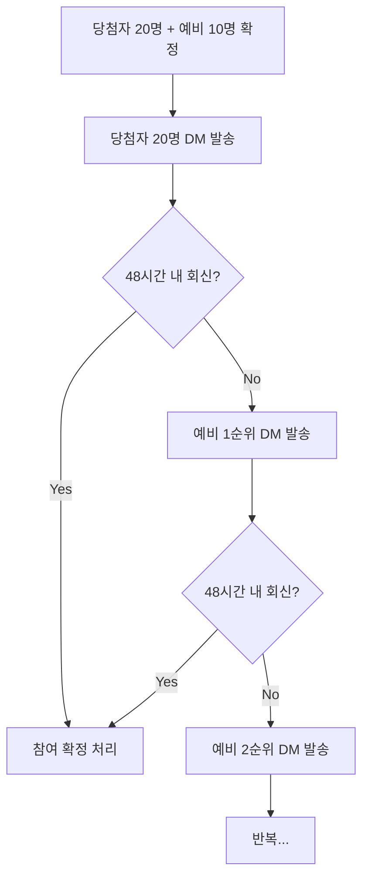

# 운영 프로세스 가이드

> **이벤트**: Calmf Sunstick X Running Crew  
> **계정**: @calmf_official  
> **당첨**: 20명 / 예비: 10명

---

## 운영 개요

| 항목 | 내용 |
|------|------|
| 당첨 인원 | 20명 |
| 예비 인원 | 10명 (순번대로 교체) |
| 참여 확정 기한 | DM 수신 후 48시간 |
| 미션 내용 | 피드 또는 릴스 1건 + @calmf_official 태그 |
| 미션 기한 | 제품 수령 후 2주 이내 |
| 미션 완료 혜택 | 풋귤 플루이드 카밍 패드 추가 증정 |
| 주의 사항 | 스토리만 업로드 시 미션 불인정 |

---

## 운영 프로세스

### Phase 1: 당첨 안내 및 참여 확정

**세부 절차**:
1. 당첨자 20명에게 "당첨 안내" DM 발송
2. 24시간 경과 시점: 미회신자 체크
3. 48시간 경과 시점: 미회신자 → 예비 교체 진행
4. 예비 당첨자에게 "예비 교체 안내" DM 발송
5. 20명 참여 확정 완료까지 반복

---

### Phase 2: 배송 정보 수집 및 발송

**세부 절차**:
1. 참여 확정 회신 수신 즉시 "배송 정보 수집" DM 발송
2. 배송 정보 수신 → 스프레드시트 기록
3. 제품 발송 처리
4. 발송 완료 시 "미션 안내" DM 발송

---

### Phase 3: 미션 관리 및 리마인드

**리마인드 일정**:
| 시점 | 액션 |
|------|------|
| 수령 확인 | 수령일 기록 (송장 추적) |
| 수령+10일 | 미완료자 1차 리마인드 |
| 수령+13일 | 미완료자 2차 리마인드 |
| 수령+14일 | 미션 마감 |

**미션 완료 확인**:
1. 참여자가 게시물 링크/캡처 회신
2. 게시물 확인 (피드 또는 릴스 / @calmf_official 태그 여부)
3. 미션 완료 처리 → 풋귤 플루이드 카밍 패드 추가 발송

---

## 체크리스트

### ✅ Phase 1: 당첨 안내 (D-Day)

- [ ] 당첨자 20명 리스트 확정
- [ ] 예비 당첨자 10명 리스트 확정 (순번 부여)
- [ ] 당첨자 20명 "당첨 안내" DM 발송
- [ ] 발송 시간 기록 (48시간 카운트 시작)

### ✅ Phase 1-2: 회신 체크 (D+1 ~ D+2)

- [ ] D+1: 24시간 미회신자 명단 확인
- [ ] D+2: 48시간 미회신자 → 예비 교체 DM 발송
- [ ] 예비 교체 진행 상황 기록
- [ ] 최종 참여 확정자 20명 명단 확정

### ✅ Phase 2: 배송 정보 수집 (참여 확정 후)

- [ ] 참여 확정자 "배송 정보 수집" DM 발송
- [ ] 배송 정보 스프레드시트 입력
  - [ ] 성함
  - [ ] 연락처
  - [ ] 배송 주소
  - [ ] 우편번호
- [ ] 제품 발송 처리
- [ ] 송장 번호 기록 및 발송 완료 DM (선택)

### ✅ Phase 3: 미션 안내 및 관리

- [ ] "미션 안내" DM 발송 (발송 완료 후)
- [ ] 수령일 추적 및 기록
- [ ] 미션 마감일 계산 (수령일+14일)

### ✅ Phase 3-2: 리마인드 (수령+10일 ~ 13일)

- [ ] 수령+10일: 미완료자 1차 "마감 리마인드" DM 발송
- [ ] 수령+13일: 미완료자 2차 "마감 리마인드" DM 발송

### ✅ Phase 4: 미션 완료 처리

- [ ] 게시물 링크/캡처 확인
- [ ] 미션 조건 충족 여부 확인
  - [ ] 피드 또는 릴스 (스토리 불가)
  - [ ] @calmf_official 태그 확인
- [ ] 미션 완료 처리 → 달성자 명단 정리
- [ ] 풋귤 플루이드 카밍 패드 추가 발송

---

## 예비 당첨자 관리

| 순번 | 닉네임 | 연락 일시 | 회신 여부 | 비고 |
|------|--------|-----------|-----------|------|
| 1 | | | | |
| 2 | | | | |
| 3 | | | | |
| 4 | | | | |
| 5 | | | | |
| 6 | | | | |
| 7 | | | | |
| 8 | | | | |
| 9 | | | | |
| 10 | | | | |

---

## 참여자 추적 시트 (샘플)

| # | 닉네임 | 참여확정 | 배송정보 | 발송일 | 수령일 | 미션기한 | 업로드확인 | 패드발송 |
|---|--------|----------|----------|--------|--------|----------|------------|----------|
| 1 | | ☐ | ☐ | | | | ☐ | ☐ |
| 2 | | ☐ | ☐ | | | | ☐ | ☐ |
| ... | | | | | | | | |
| 20 | | ☐ | ☐ | | | | ☐ | ☐ |

---

## 주의 사항

> [!IMPORTANT]
> - **미션 조건**: 피드 또는 릴스만 인정. **스토리는 미션으로 불인정**.
> - **태그 필수**: @calmf_official 태그 누락 시 미션 불완료.
> - **기한 엄수**: 48시간 회신 없으면 예비 교체, 2주 이내 미업로드 시 추가 증정 대상 제외.

---

## 일정 요약

| 단계 | 기간 | 주요 액션 |
|------|------|-----------|
| 당첨 안내 | D-Day | DM 발송, 48시간 타이머 시작 |
| 참여 확정 | D+1~2 | 회신 체크, 예비 교체 |
| 배송 정보 수집 | 확정 후 즉시 | 정보 수집. 발송 |
| 미션 안내 | 발송 후 | 미션 조건 공지 |
| 리마인드 | 수령+10~13일 | 미완료자 리마인드 |
| 미션 마감 | 수령+14일 | 최종 확인 |
| 추가 발송 | 마감 후 | 패드 발송 |
